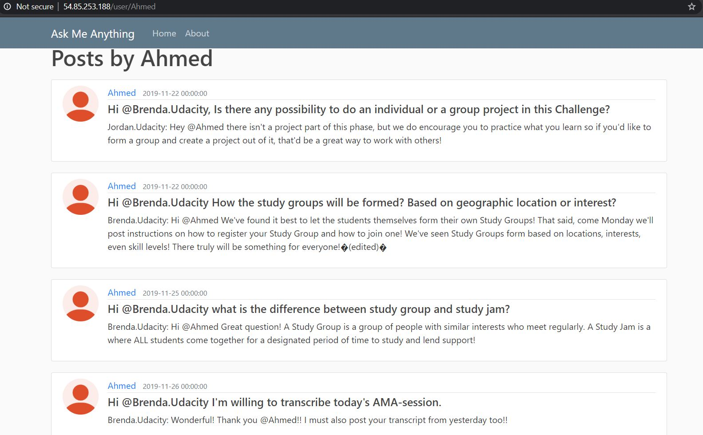

# Ask Me Anything (AMA)

<a id='index'></a>
## Table of Contents
- [Project Overview](#overview)
- [Functionalities](#func)
- [Infrastructure Diagram](#diagram)
- [CloudFormation](#cloudformation)
- [References](#ref)


<a id='video'></a>
**_Video Demo of the [deployed App](http://54.85.253.188/)(http://ec2-54-85-253-188.compute-1.amazonaws.com)_**

<hr/> 

[Back to Table of Content](#index)


<a id='overview'></a>
## Project Overview

**_What is an AMA?_**</br>
AMA us simply **Ask Me Anything.**</br> These sessions are initiated by the Udacity Community team. </br>You can ask questions and they personally reply to your queries. </br> 
**_Who are the Udacity community team?_**</br>
Clayton, Slack handle: @Clayton.Udacity. </br>
Brenda Law, Slack handle: @Brenda.Udacity. </br>
Grace, Slack handle: @Grace.Udacity. </br>
Palak, Slack handle: @Palak.Udacity. </br>
Jordan, Slack handle: @Jordan.Udacity. </br> 
**_What do you ask?_**</br>
You can ask anything which is non-technical in nature like scholarship concerns.</br> 
**_What is the purpose of this app?_** </br>
This web app will give a nice interface to go over different questions asked in the AMA sessions. </br>
Also it will act as an archive of all previous questions in AMA sessions even they are deleted from the slack channel. </br>

[Back to Table of Content](#index)
 
<a id='func'></a>
## Functionalities
**Home Page**

**About Page**

**Pagination**

**User Posts**

 

[Back to Table of Content](#index)

<a id='diagram'></a>
## Infrastructure Diagram

<hr/> 

[Back to Table of Content](#index)

<a id='cloudformation'></a>
## CloudFormation
A cloud formation template consists of multiple sections. Typical sections include the template's format version, description, parameters, resources, and outputs. 
1. The format version defines the format in which this template is written. This is allows the cloud formation servers to use the correct interpreters for each template, thus enabling users to continue to use the older versions, even when newer format versions have been released. 
1. The description field is just a human-readable description of the template, intended to provide the template user with instructions and information. 
1. Parameters section consists of a list of parameters that are used in the template, and anyone who wants to use this template must provide the parameter values in order to create a stack from it. The onus is on the template developer to decide what values they would accept as parameters, and which ones they would like to fix in the template. Values typically exposed as parameters are the values that often change between similar stacks, for example names, number of instances, instance types, etc. 
1. The single most important section of a cloud formation template is the resources section, because, after all, the primary job here is to provision the resources. So in here we would have a list of resources, and those resources could include instances, security groups, S3 buckets, VPCs, etc. 
1. Typically, the last section of a cloud formation template is outputs. Outputs specify the values from the template that the template developer feels should be easy to access in a given stack. These can be accessed easily via the AWS console, or the CLI or API. A classic example of an output is the endpoint of an ELB. When provisioning a web stack, it is usually the single most important piece of information a user would want to access after deploying the stack, because it is the endpoint that they will use to check if the template has deployed correctly. By making this endpoint an output, the user can access the endpoint from the outputs console, and test the stack conveniently. Once a template contains some or all of these sections, it can be used to create a cloud formation stack.
<hr/> 

YAML File

```
Description: >
    Carlos Rivas / Udacity
    This template deploys a VPC, with a pair of public and private subnets spread 
    across two Availabilty Zones. It deploys an Internet Gateway, with a default 
    route on the public subnets. It deploys a pair of NAT Gateways (one in each AZ), 
    and default routes for them in the private subnets.

Parameters:

    EnvironmentName:
        Description: An environment name that will be prefixed to resource names
        Type: String

    VpcCIDR: 
        Description: Please enter the IP range (CIDR notation) for this VPC
        Type: String
        Default: 10.0.0.0/16

    PublicSubnet1CIDR:
        Description: Please enter the IP range (CIDR notation) for the public subnet in the first Availability Zone
        Type: String
        Default: 10.0.0.0/24

    PublicSubnet2CIDR:
        Description: Please enter the IP range (CIDR notation) for the public subnet in the second Availability Zone
        Type: String
        Default: 10.0.1.0/24

    PrivateSubnet1CIDR:
        Description: Please enter the IP range (CIDR notation) for the private subnet in the first Availability Zone
        Type: String
        Default: 10.0.2.0/24

    PrivateSubnet2CIDR:
        Description: Please enter the IP range (CIDR notation) for the private subnet in the second Availability Zone
        Type: String
        Default: 10.0.3.0/24

Resources:

    VPC: 
        Type: AWS::EC2::VPC
        Properties:
            CidrBlock: !Ref VpcCIDR
            EnableDnsHostnames: true
            Tags: 
                - Key: Name 
                  Value: !Ref EnvironmentName
            
    InternetGateway:
        Type: AWS::EC2::InternetGateway
        Properties:
            Tags:
                - Key: Name
                  Value: !Ref EnvironmentName
            
    InternetGatewayAttachment:
        Type: AWS::EC2::VPCGatewayAttachment
        Properties:
            InternetGatewayId: !Ref InternetGateway
            VpcId: !Ref VPC

    PublicSubnet1: 
        Type: AWS::EC2::Subnet
        Properties:
            VpcId: !Ref VPC
            AvailabilityZone: !Select [ 0, !GetAZs '' ]
            CidrBlock: !Ref PublicSubnet1CIDR
            MapPublicIpOnLaunch: true
            Tags: 
                - Key: Name 
                  Value: !Sub ${EnvironmentName} Public Subnet (AZ1)

    PublicSubnet2: 
        Type: AWS::EC2::Subnet
        Properties:
            VpcId: !Ref VPC
            AvailabilityZone: !Select [ 1, !GetAZs '' ]
            CidrBlock: !Ref PublicSubnet2CIDR
            MapPublicIpOnLaunch: true
            Tags: 
                - Key: Name 
                  Value: !Sub ${EnvironmentName} Public Subnet (AZ2)

    PrivateSubnet1: 
        Type: AWS::EC2::Subnet
        Properties:
            VpcId: !Ref VPC
            AvailabilityZone: !Select [ 0, !GetAZs '' ]
            CidrBlock: !Ref PrivateSubnet1CIDR
            MapPublicIpOnLaunch: false
            Tags: 
                - Key: Name 
                  Value: !Sub ${EnvironmentName} Private Subnet (AZ1)

    PrivateSubnet2: 
        Type: AWS::EC2::Subnet
        Properties:
            VpcId: !Ref VPC
            AvailabilityZone: !Select [ 1, !GetAZs '' ]
            CidrBlock: !Ref PrivateSubnet2CIDR
            MapPublicIpOnLaunch: false
            Tags: 
                - Key: Name 
                  Value: !Sub ${EnvironmentName} Private Subnet (AZ2)

    NatGateway1EIP:
        Type: AWS::EC2::EIP
        DependsOn: InternetGatewayAttachment
        Properties: 
            Domain: vpc

    NatGateway2EIP:
        Type: AWS::EC2::EIP
        DependsOn: InternetGatewayAttachment
        Properties:
            Domain: vpc

    NatGateway1: 
        Type: AWS::EC2::NatGateway
        Properties: 
            AllocationId: !GetAtt NatGateway1EIP.AllocationId
            SubnetId: !Ref PublicSubnet1

    NatGateway2: 
        Type: AWS::EC2::NatGateway
        Properties:
            AllocationId: !GetAtt NatGateway2EIP.AllocationId
            SubnetId: !Ref PublicSubnet2

    PublicRouteTable:
        Type: AWS::EC2::RouteTable
        Properties: 
            VpcId: !Ref VPC
            Tags: 
                - Key: Name 
                  Value: !Sub ${EnvironmentName} Public Routes

    DefaultPublicRoute: 
        Type: AWS::EC2::Route
        DependsOn: InternetGatewayAttachment
        Properties: 
            RouteTableId: !Ref PublicRouteTable
            DestinationCidrBlock: 0.0.0.0/0
            GatewayId: !Ref InternetGateway

    PublicSubnet1RouteTableAssociation:
        Type: AWS::EC2::SubnetRouteTableAssociation
        Properties:
            RouteTableId: !Ref PublicRouteTable
            SubnetId: !Ref PublicSubnet1

    PublicSubnet2RouteTableAssociation:
        Type: AWS::EC2::SubnetRouteTableAssociation
        Properties:
            RouteTableId: !Ref PublicRouteTable
            SubnetId: !Ref PublicSubnet2
    

    PrivateRouteTable1:
        Type: AWS::EC2::RouteTable
        Properties: 
            VpcId: !Ref VPC
            Tags: 
                - Key: Name 
                  Value: !Sub ${EnvironmentName} Private Routes (AZ1)

    DefaultPrivateRoute1:
        Type: AWS::EC2::Route
        Properties:
            RouteTableId: !Ref PrivateRouteTable1
            DestinationCidrBlock: 0.0.0.0/0
            NatGatewayId: !Ref NatGateway1

    PrivateSubnet1RouteTableAssociation:
        Type: AWS::EC2::SubnetRouteTableAssociation
        Properties:
            RouteTableId: !Ref PrivateRouteTable1
            SubnetId: !Ref PrivateSubnet1

    PrivateRouteTable2:
        Type: AWS::EC2::RouteTable
        Properties: 
            VpcId: !Ref VPC
            Tags: 
                - Key: Name 
                  Value: !Sub ${EnvironmentName} Private Routes (AZ2)

    DefaultPrivateRoute2:
        Type: AWS::EC2::Route
        Properties:
            RouteTableId: !Ref PrivateRouteTable2
            DestinationCidrBlock: 0.0.0.0/0
            NatGatewayId: !Ref NatGateway2

    PrivateSubnet2RouteTableAssociation:
        Type: AWS::EC2::SubnetRouteTableAssociation
        Properties:
            RouteTableId: !Ref PrivateRouteTable2
            SubnetId: !Ref PrivateSubnet2

Outputs: 

    VPC: 
        Description: A reference to the created VPC
        Value: !Ref VPC
        Export:
          Name: !Sub ${EnvironmentName}-VPCID

    VPCPublicRouteTable:
        Description: Public Routing
        Value: !Ref PublicRouteTable
        Export:
          Name: !Sub ${EnvironmentName}-PUB-RT

    VPCPrivateRouteTable1:
        Description: Private Routing AZ1
        Value: !Ref PrivateRouteTable1
        Export:
          Name: !Sub ${EnvironmentName}-PRI1-RT

    VPCPrivateRouteTable2:
        Description: Private Routing AZ2
        Value: !Ref PrivateRouteTable2
        Export:
          Name: !Sub ${EnvironmentName}-PRI2-RT

    PublicSubnets:
        Description: A list of the public subnets
        Value: !Join [ ",", [ !Ref PublicSubnet1, !Ref PublicSubnet2 ]]
        Export:
          Name: !Sub ${EnvironmentName}-PUB-NETS

    PrivateSubnets:
        Description: A list of the private subnets
        Value: !Join [ ",", [ !Ref PrivateSubnet1, !Ref PrivateSubnet2 ]]
        Export:
          Name: !Sub ${EnvironmentName}-PRIV-NETS

    PublicSubnet1:
        Description: A reference to the public subnet in the 1st Availability Zone
        Value: !Ref PublicSubnet1
        Export:
          Name: !Sub ${EnvironmentName}-PUB1-SN

    PublicSubnet2: 
        Description: A reference to the public subnet in the 2nd Availability Zone
        Value: !Ref PublicSubnet2
        Export:
          Name: !Sub ${EnvironmentName}-PUB2-SN

    PrivateSubnet1:
        Description: A reference to the private subnet in the 1st Availability Zone
        Value: !Ref PrivateSubnet1
        Export:
          Name: !Sub ${EnvironmentName}-PRI1-SN

    PrivateSubnet2: 
        Description: A reference to the private subnet in the 2nd Availability Zone
        Value: !Ref PrivateSubnet2
        Export:
          Name: !Sub ${EnvironmentName}-PRI2-SN
```

[Back to Table of Content](#index)

<a id='ref'></a>
## References
1. [Deploy Django and Flask Applications in the cloud using Nginx, Gunicorn and Supervisor](https://medium.com/@vahiwe/deploy-django-and-flask-applications-in-the-cloud-using-nginx-gunicorn-and-supervisor-a968dc618b22)
1. [Flask Tutorials](https://www.youtube.com/playlist?list=PL-osiE80TeTs4UjLw5MM6OjgkjFeUxCYH)
<hr/> 

[Back to Table of Content](#index)
